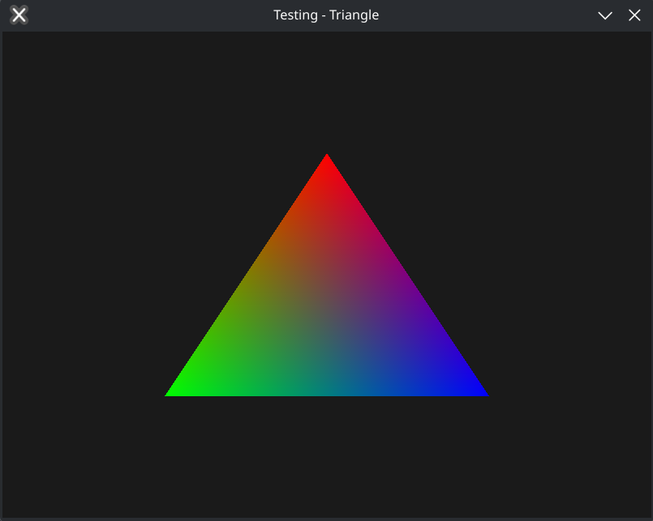

# hood

A cross-platform graphics library for LuaJIT entirely from scratch.  
Based upon the WebGPU and Vulkan specifications.

<p align="center">
  
</p>

<p align="center">
  <em>See the <a href="./examples/triangle">triangle example</a> for the full code.</em>
</p>

## Backends

| Backend     | Windows | Linux | macOS |
| ----------- | ------- | ----- | ----- |
| OpenGL 4.3+ | ✅      | ✅    | ❌    |
| Vulkan      | 🚧      | 🚧    | ❌    |

## Installation

This is mainly intended to be consumed with the [lpm](https://github.com/codebycruz/lpm) package manager.

```bash
lpm add --git https://github.com/codebycruz/hood
```
